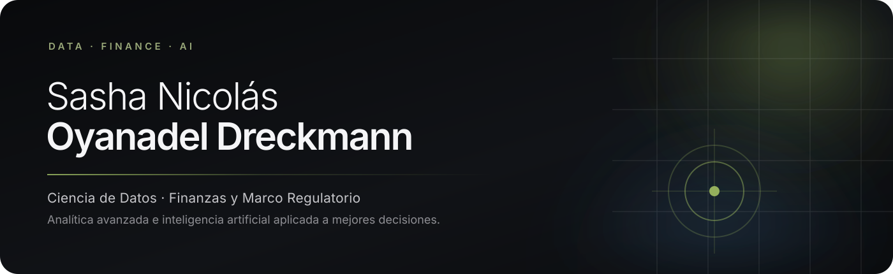

  

  <a href="https://www.linkedin.com/in/sashaoyanadeldreckmann"><strong>LinkedIn</strong></a>
  &nbsp;&nbsp;·&nbsp;&nbsp;
  <a href="mailto:sasha.oyanadel@ug.uchile.cl"><strong>Email</strong></a>
  &nbsp;&nbsp;·&nbsp;&nbsp;
  Santiago, Chile

---

## Perfil

Estudiante del programa de doble titulación en **Ingeniería Civil Industrial y Magíster en Ciencia de Datos** de la Universidad de Chile, con tesis entregada para optar al título profesional y al grado de magíster.

Me especializo en la intersección entre **estadística, finanzas e inteligencia artificial**. Me interesa construir sistemas que conviertan información compleja en decisiones comprensibles, trazables y responsables, especialmente cuando operan bajo marcos regulatorios exigentes.

> Mi tesis explora esa pregunta en el sistema financiero chileno: cómo integrar evidencia personal, normativa y modelos de lenguaje sin confundir apoyo informacional con asesoría financiera vinculante.

## Proyectos relevantes

### 01 — [Agente conversacional para finanzas personales](https://github.com/SashaOyanadelDreckmann/locoplaya666-final-financial-agent)

**Tesis de doble titulación.** Diseñé, implementé y desplegué una aplicación web que simula principios de la **Ley Fintech 21.521** y del **Sistema de Finanzas Abiertas**, sin operar como prestador regulado. Integra cartolas, presupuesto, normativa chilena e indicadores de mercado con consentimiento, pseudonimización y trazabilidad de fuentes CMF/BCN.

`TypeScript` `Next.js` `Fastify` `PostgreSQL` `LLMs` `RAG` `ReAct` `MCP`

### 02 — [SodAI Drinks · Pronóstico de demanda](https://github.com/SashaOyanadelDreckmann/SodAI-Drinks-Pron-stico-de-Demanda)

Pipeline end-to-end para pronóstico semanal de demanda: experimentación, optimización, explicabilidad y despliegue de una interfaz de análisis.

`Python` `Series de tiempo` `Airflow` `MLflow` `Optuna` `SHAP` `FastAPI` `Docker`

### 03 — [Agentes conversacionales · Xtiende](https://github.com/SashaOyanadelDreckmann/Agentes-Xtiende-preliminar)

Exploración de una arquitectura multiagente para flujos de onboarding y matching entre empresas, con foco en criterios de integración robusta y escalable.

`LLMs` `Agentes` `APIs` `SaaS` `Arquitectura de producto`

## Formación

- **Universidad de Chile** — Programa de doble titulación en Ingeniería Civil Industrial y Magíster en Ciencia de Datos.
- **Greentech** — Diplomado en Consultoría en IA, Automatizaciones y Agentes IA.

## En qué estoy trabajando

- Sistemas de IA aplicados a decisiones financieras.
- Finanzas abiertas, consentimiento y trazabilidad de datos.
- Modelación estadística y productos analíticos desplegables.
- Optimización de portafolios y evaluación de riesgo bajo el marco chileno.

## Competencias

<strong>CORE STACK</strong>

  

 

<table>
  <tr>
    <td width="50%" valign="top">
      <strong>DATOS Y MODELACIÓN ESTADÍSTICA</strong>
        
      
      
      
       
      Series de tiempo · inferencia estadística · clasificación · optimización · Monte Carlo
    </td>
    <td width="50%" valign="top">
      <strong>INTELIGENCIA ARTIFICIAL Y DESPLIEGUE</strong>
        
      
      
      
       
      RAG · ReAct · MCP · APIs · experimentación · trazabilidad · despliegue
    </td>
  </tr>
  <tr>
    <td width="50%" valign="top">
      <strong>FINANZAS Y MARCOS REGULATORIOS</strong>
        
      
      
      
       
      Ley Fintech 21.521 · SFA · portafolios · riesgo · Solver · curvas · derivados
    </td>
    <td width="50%" valign="top">
      <strong>PRODUCTO, CONSULTORÍA Y EJECUCIÓN</strong>
        
      
      
      
       
      Estructuración de problemas · discovery · arquitectura de producto · documentación ejecutiva
    </td>
  </tr>
</table>

---

**Datos convertidos en sistemas. Sistemas convertidos en mejores decisiones.**

[Conversemos en LinkedIn](https://www.linkedin.com/in/sashaoyanadeldreckmann) · [Escríbeme](mailto:sasha.oyanadel@ug.uchile.cl)

